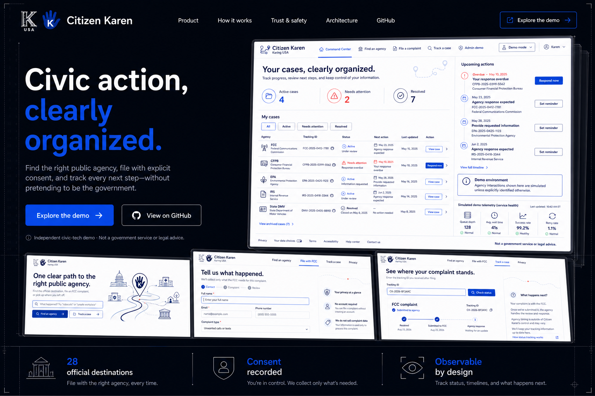

# Citizen Karen™

[](https://github.com/Lipford-Dutch/citizen-karen-platform/actions/workflows/ci.yml)
[](https://lipford-dutch.github.io/citizen-karen-platform/)
[](https://github.com/Lipford-Dutch/citizen-karen-platform/releases)
[](LICENSE)

Citizen Karen is a consent-first civic complaint navigator and unified intake-platform demonstration. It combines 28 official destinations with a local Command Center, a registry-driven form engine, durable audit trails, retry and escalation workflows, and eight explicitly simulated agency plugins.

[Explore the project showcase](https://lipford-dutch.github.io/citizen-karen-platform/) · [Run the demo](docs/DEMO_RUNBOOK.md) · [Read the architecture](docs/SYSTEM_ARCHITECTURE.md) · [Join Discussions](https://github.com/Lipford-Dutch/citizen-karen-platform/discussions)

[](https://lipford-dutch.github.io/citizen-karen-platform/)

> [!IMPORTANT]
> This repository is an interactive engineering demo, not a government service or legal advice. No production agency credentials or endpoints are included. FCC uses the repository mock; IRS, FTC, EPA, CFPB, State DMV, Benefits, and Failure Lab are high-fidelity local simulations. Do not deploy the demo to the public internet or use real complaint data.

**Current release:** `1.0.0-rc.2` — a stakeholder-ready local demonstration, not a production authorization.

## What works

- Searchable, deduplicated directory built from the local complaint-source workbook and research notes
- Responsive React 19 interface with semantic navigation, keyboard support, reduced-motion handling, and automated axe checks
- Consent-gated FCC form with review step, draft recovery, anti-bot honeypot, and sensitive-number rejection
- FastAPI, Postgres source-of-truth, Alembic, immutable audit events, PII-safe logs, and security headers
- Redis + Celery submission, polling, exponential retry, escalation scans, and MailHog confirmations
- Demo JWT roles, evidence scanning/retention stub, rate/velocity controls, honeypot, and KYC-lite declaration
- Prometheus, pre-provisioned Grafana, and OpenTelemetry traces for APIs, database operations, plugins, and jobs
- Tracking timeline with agency reference, copy action, and local-content deletion
- Simulated connector for zero-credential local use plus a network mock for the Docker stack
- Reproducible frontend, backend, mock-agency, and reverse-proxy containers

## Run the complete stack

Requirements: Docker Desktop with Compose v2.

```bash
docker compose -f infra/docker-compose.yml up --build
```

Open <http://localhost:8080>. The API is also exposed at <http://localhost:8000>, with interactive docs at <http://localhost:8000/api/docs>. Stop the stack with:

```bash
docker compose -f infra/docker-compose.yml down
```

Named Postgres, Redis, Prometheus, and Grafana volumes preserve local demo state. Use `docker compose -f infra/docker-compose.yml down --volumes` only when you intentionally want to remove it.

Demo endpoints:

- App: <http://localhost:8080>
- API/OpenAPI: <http://localhost:8000/api/docs>
- Grafana: <http://localhost:3000> (anonymous viewer; local admin `admin` / `demo-admin`)
- Prometheus: <http://localhost:9090>
- MailHog: <http://localhost:8025>

The seed job creates eight synthetic cases covering healthy, retrying, failed, escalated, and resolved states. See the [demo runbook](docs/DEMO_RUNBOOK.md) for the recommended ten-minute walkthrough and safe reset procedure.

## Develop locally

Backend (Python 3.14):

```bash
cd backend
python -m venv .venv
# Windows: .venv\Scripts\Activate.ps1
# macOS/Linux: source .venv/bin/activate
python -m pip install -r requirements.txt -r requirements-dev.txt
uvicorn app.main:app --reload
```

Frontend (Node.js 24):

```bash
cd frontend
npm ci
npm run dev
```

Vite proxies `/api` to the backend at port 8000. The default backend connector uses a safe simulation and needs no account or API key.

## Verify

```bash
cd backend
python -m ruff check .
python -m ruff format --check .
python -m mypy app --ignore-missing-imports
python -m pytest --cov=app --cov-fail-under=90

cd ../frontend
npm run lint
npm test
npm run build
npm audit --audit-level=high

cd ..
docker compose -f infra/docker-compose.yml config --quiet
python -m mkdocs build --strict
```

## Architecture

```text
Browser → nginx SPA/reverse proxy → FastAPI → Postgres source of truth
                                      │  └──→ Redis → Celery worker/scheduler
                                      │                    └──→ plugin registry
                                      │                          ├─ mock FCC service
                                      │                          └─ explicit local mocks
                                      └────→ Prometheus + OpenTelemetry → Grafana
```

The curated directory preserves official links. Demo-enabled entries are labeled as simulated and display risk, KYC, automation, and legal-boundary declarations from the plugin manifest.

### Demonstrated platform capabilities

| Capability | Demo implementation | Production boundary |
| --- | --- | --- |
| Source of truth | Postgres, Alembic, immutable audit events | Managed encryption, backups, and recovery testing remain required |
| Async workflows | Redis, Celery, retry, polling, escalation | Multi-region durability and operational SLOs are not claimed |
| Agency integrations | FCC network mock plus seven local simulations | No production government endpoint or credential is included |
| Identity and abuse controls | Synthetic JWT roles, honeypot, rate and velocity controls | Replace demo identity and process-local limits before shared deployment |
| Evidence | Local attachment, signature scan stub, retention metadata | Production object storage and malware scanning remain required |
| Observability | Prometheus, Grafana, OpenTelemetry, PII-safe logs | Alert routing and managed telemetry require deployment design |

## Repository map

- `frontend/` — TypeScript, React, Vite, UI tests, and production nginx image
- `backend/` — FastAPI app, Postgres/SQLite repository layer, Alembic, plugin registry, Celery tasks, metrics, and pytest suite
- `api/openapi.yaml` — checked-in OpenAPI 3.1 contract
- `infra/` — Compose stack and service images
- `docs/` — product, accessibility, security, consent, architecture, and handoff material
- `docs/design/` — accepted visual concepts, product captures, and GitHub Pages design spec

See [Developer setup](docs/DEVELOPER_SETUP.md), [release notes](docs/RELEASE_NOTES_1.0.0_RC2.md), [release handoff](docs/HANDOFF.md), [security policy](SECURITY.md), [support](SUPPORT.md), and the [contributing guide](CONTRIBUTING.md).

## License

[MIT](LICENSE)
